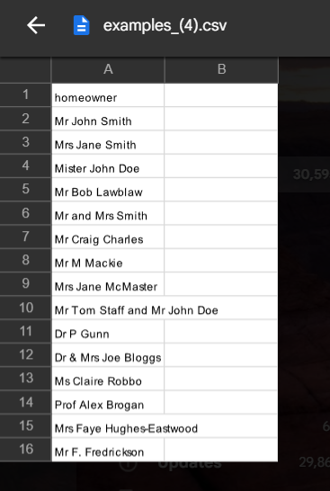
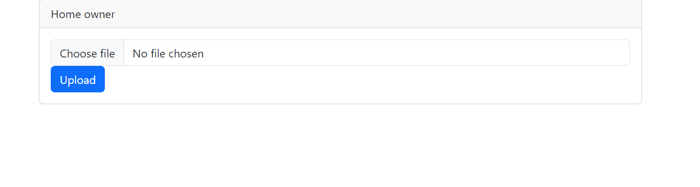
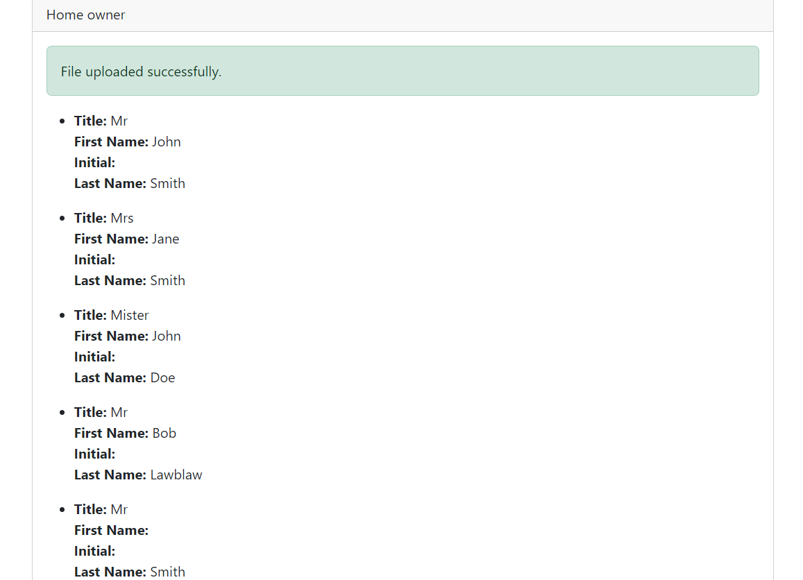

## Installation

Please check the official laravel installation guide for server requirements before you start. [Official Documentation](https://laravel.com/docs/10.x/installation).

**Command list**

    git clone https://github.com/viral02/spiltname.git
    cd spiltname
    cp .env.example .env or copy .env.example .env
    php artisan key:generate
    composer install
    npm install
    npm run dev
    php artisan serve
    
    I have attached screenshot below for input and output values:

## Contributing

    (1) Viral Desai - viraldesai7642@gmail.com
